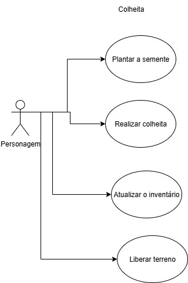
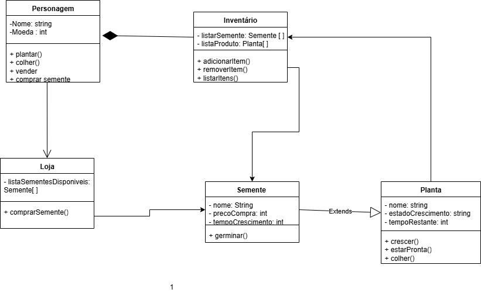

# TERRAS VERDES
Métodos Formais de Engenharia de Software

O presente trabalho apresenta o desenvolvimento de um jogo digital de simulação agrícola, construído com o motor de jogos Godot Engine. O 
projeto tem como objetivo proporcionar ao jogador uma experiência lúdica e interativa de cultivo, colheita e gerenciamento de recursos em um 
ambiente virtual simples, reforçando conceitos de planejamento, organização e tomada de decisão. 

LINK DEFINIÇÃO DOPROJETO();

# ODS - 2 FOME ZERO E AGRICULTURA SUSTENTÁVEL e  ODS 15 – Vida Terrestre
- No começo, o jogador planta para sobreviver.
- O jogador planta a semente e tem que esperar ela crescer para poder colher, mostra que a agricultura é um ciclo e precisa ser respeitado.
- O jogador planta sementes, cuida das plantas e colhe alimentos. Isso mostra o ciclo básico da agricultura, essencial para acabar com a fome.
- As moedas obtidas podem ser usadas para comprar sementes de alimentos nutritivos(frutas, legumes, grãoes) em vez de apenas pantas genéricas.

# REQUISITOS link(https://docs.google.com/document/d/1c08Crlcs61BK9z0SJDSyX5ASluT9DHQlgOhTPDMDVrs/edit?usp=sharing);

# DiAGRAMAS DE CASOS DE USO 

# DIAGRAMAS DE CLASSES 

# PLANO PARA ESPECIFICAÇÃO FORMAL
LINK();

# APRESENTAÇÃO
LINK(https://www.canva.com/design/DAG0W8bQ8Mo/i2dJ0e48gpE_VrCjdFPCEw/edit?utm_content=DAG0W8bQ8Mo&utm_campaign=designshare&utm_medium=link2&utm_source=sharebutton);
