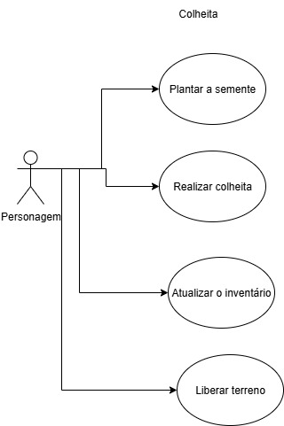
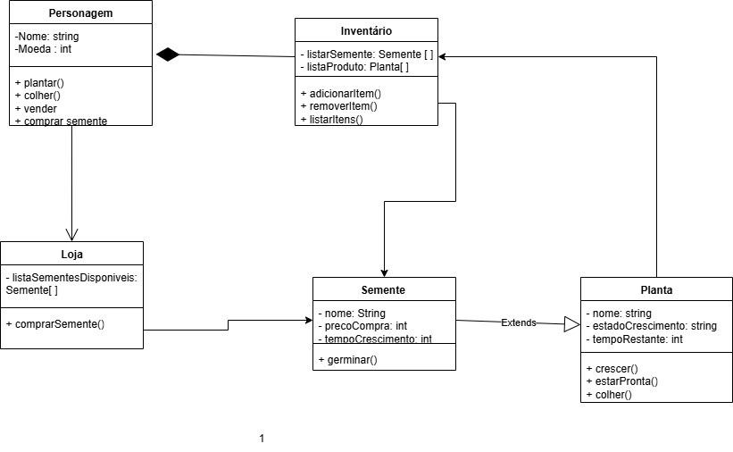

# TERRAS VERDES
Métodos Formais de Engenharia de Software

O presente trabalho apresenta o desenvolvimento de um jogo digital de simulação agrícola, construído com o motor de jogos Godot Engine. O 
projeto tem como objetivo proporcionar ao jogador uma experiência lúdica e interativa de cultivo, colheita e gerenciamento de recursos em um ambiente virtual simples, reforçando conceitos de planejamento, organização e tomada de decisão. 

Fase de desenvolvimento:
O jogo foi concluído, sendo possível plantar dentro do campo destinado a plantação, 6itens diferentes, sendo eles 3 tipos de frutas(abacaxi, laranja e morango) e 3 tipos de vegetais(berinjela, batata e milho). Também é possível entrar na casa, ir até o cercado das galinhas e o dos bizerros.

ações:

- Plantar milho, usando a letra M;
- Plantar batata usando a letra X;
- Plantar berinjela usando a letra V;
- Plantar abacaxi usando a letra z;
- plantar morango usando a letra B;
- plantar laranjas usando a letra N;
  
- Colher usando a letra C;

- Vender os vegetais usando a letra Q.

Personagens desenvolvidos:

- O fazendeiro
- O comprador, esse pergunta se o fazendeiro quer vender algo quando ele chega perto.

No canto superior é possível vizualizar a quantidade de semente que você pegou no balde, a quantidade de vegetal e fruta que você colheu e o dinheiro que recebe com a venda dos produtos.

# ODS - 2 FOME ZERO E AGRICULTURA SUSTENTÁVEL 
- No começo, o jogador planta para sobreviver.
- O jogador planta a semente e tem que esperar ela crescer para poder colher, mostra que a agricultura é um ciclo e precisa ser respeitado.
- O jogador planta sementes, cuida das plantas e colhe alimentos. Isso mostra o ciclo básico da agricultura, essencial para acabar com a fome.
- As moedas obtidas podem ser usadas para comprar sementes de alimentos nutritivos(frutas, legumes, grãoes) em vez de apenas pantas genéricas.

# REQUISITOS link(https://docs.google.com/document/d/1c08Crlcs61BK9z0SJDSyX5ASluT9DHQlgOhTPDMDVrs/edit?usp=sharing);

# DiAGRAMAS DE CASOS DE USO 

# DIAGRAMAS DE CLASSES 

# PLANO PARA ESPECIFICAÇÃO FORMAL
LINK(https://docs.google.com/document/d/1HSAzPctcLFDkGFSJ_cGiruchaLZiQZC5H1hpZHNV3oo/edit?usp=sharing);

# ARTIGO
[TERRAS_VERDES, JOGO_ELETRONICO.pdf](https://github.com/user-attachments/files/24174762/TERRAS_VERDES.JOGO_ELETRONICO.pdf)

